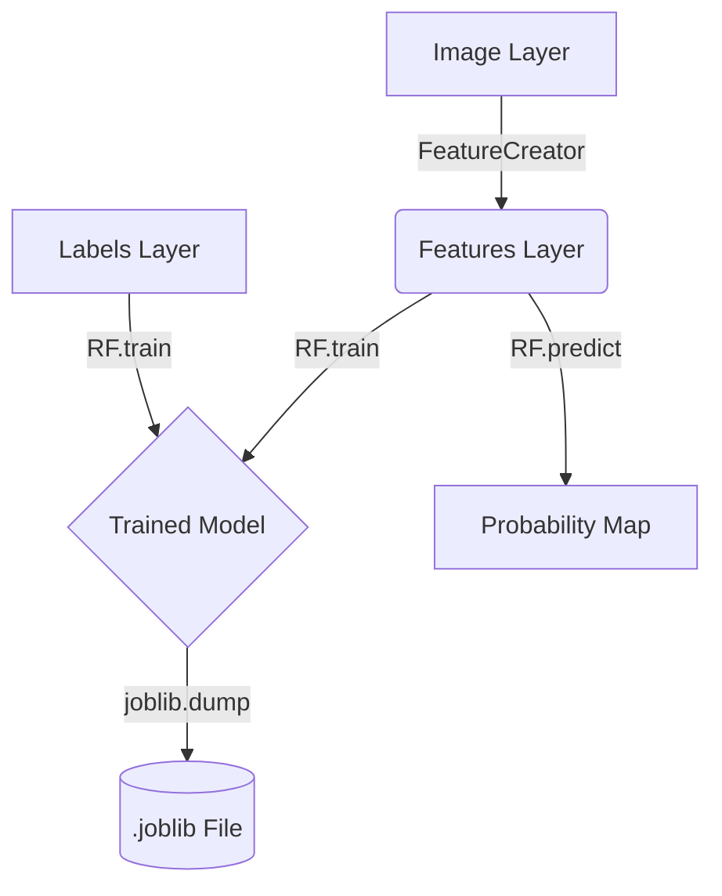

# Architecture

The `napari-rf` plugin follows a decoupled design where the GUI logic, feature engineering, and machine learning models are separated into distinct modules.

## Component Overview

### 1. `RFWidget` (`src/napari_rf/_widget.py`)
The primary interface. It handles:
- **State Management**: Keeps track of the `RF` model instance and `FeatureCreator`.
- **Napari Integration**: Accesses layers via `self.viewer.layers`.
- **Event Handling**: Connects QT buttons to processing logic.

### 2. `FeatureCreator` (`src/napari_rf/features.py`)
This class encapsulates the feature engineering pipeline.
- **`make_simple_features(*imgs)`**:
    - Uses `skimage.feature.multiscale_basic_features`.
    - Adds custom Sobel filters, Gaussian differences, and Laplacian of Gaussian (LoG).
    - Returns a concatenated multi-channel `numpy` array.

### 3. `RF` (`src/napari_rf/RF.py`)
A wrapper around `sklearn.ensemble.RandomForestClassifier`.
- **Training**: Uses `skimage.future.fit_segmenter` which allows training on sparse label arrays (where 0 indicates unlabelled pixels).
- **Prediction**: Optimized for image stacks. It reshapes the input feature blocks into vectors for `scikit-learn` and then reshapes the results back into image dimensions.

## Data Flow Diagram

## Key Decisions
- **Sparse Labels**: We support `skimage` style segmentation where 0-valued labels are ignored during training, allowing for very fast user feedback loops.
- **Multithreading**: `n_jobs=-1` is set in the Random Forest constructor to utilize all available CPU cores during training and prediction.
