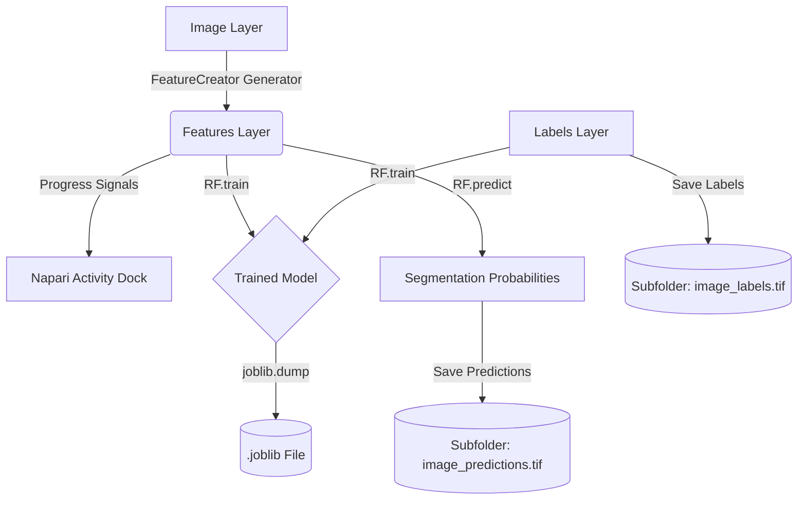

# Architecture

The `napari-rf` plugin follows a decoupled design where the GUI logic, feature engineering, and machine learning models are separated into distinct modules.

## Component Overview

### 1. `RFWidget` (`src/napari_rf/_widget.py`)
The primary interface. It handles:
- **Asynchronous Execution**: Uses `napari.qt.threading.thread_worker` to run long-running tasks (feature extraction) in background threads, keeping the GUI responsive.
- **Progress Reporting**: Listens to generator yields from the feature extraction thread to update a `napari.utils.progress` bar on the main thread.
- **State Management**: Keeps track of the `RF` model instance, `FeatureCreator`, and the active image's metadata (path, name) for smart saving.
- **Event Handling**: Connects QT buttons to processing logic and manages button enablement by listening to napari's `layers.events`.

### 2. `FeatureCreator` (`src/napari_rf/features.py`)
This class encapsulates a generator-based feature engineering pipeline.
- **Generator Model**: `make_simple_features` yields step-by-step progress info, allowing real-time feedback in the UI.
- **Advanced Pipeline**:
    - **Normalization**: Pre-processes images using 0.5% - 99.5% percentile scaling for lighting/exposure robust extraction.
    - **Feature Stack**:
        - Original intensity.
        - Multiscale basic features (texture, edges) via `skimage`.
        - Local standard deviation.
        - Difference of Gaussians (DoG) for blob/edge detection.
        - Hessian Determinant (blobness) at multiple scales.
        - Shape index.
        - Local Binary Pattern (LBP) for robust texture classification.
- **3D Handling**: Stacks (3D images) are processed slice-by-slice to maintain a consistent feature representation and prevent memory overflows.

### 3. `RF` (`src/napari_rf/RF.py`)
A wrapper around `sklearn.ensemble.RandomForestClassifier`.
- **Training**: Uses `skimage.future.fit_segmenter` which allows training on sparse label arrays (where 0 indicates unlabelled pixels).
- **Prediction**: Optimized for image stacks. It reshapes the input feature blocks into vectors for `scikit-learn` and then reshapes the results back into image dimensions.

## Data Flow Diagram

## Key Decisions
- **Thread Safety**: All UI updates (progress bars, layer additions) occur on the main thread via Qt signals, while heavy computation happens in background threads.
- **Relative Saving**: Results are saved relative to the input image file's directory to maintain organization across large datasets.
- **Data Optimization**: Labels are saved as `uint8` to save space and avoid low-contrast warnings in downstream processing.
