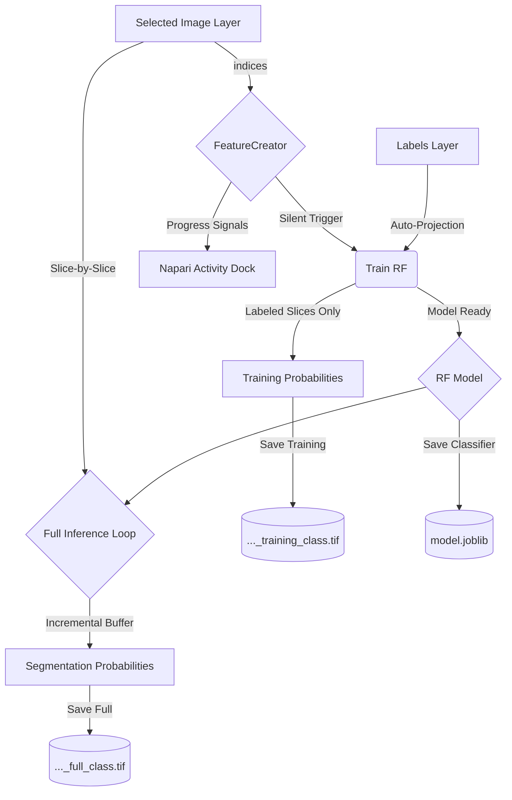

# Architecture

The `napari-rf` plugin follows a decoupled design where the GUI logic, feature engineering, and machine learning models are separated into distinct modules. It is specifically engineered for memory efficiency, allowing it to process large 3D stacks that exceed available RAM via slice-wise execution.

## Component Overview

### 1. `RFWidget` (`src/napari_rf/_widget.py`)
The central controller managing state and user interaction.
- **On-Demand Execution**: Feature extraction is auto-triggered by training or inference tasks, eliminating redundant steps.
- **Asynchronous Execution**: Uses `napari.qt.threading.thread_worker` to keep the UI responsive during heavy computation.
- **Memory Management**: Orchestrates a "Generate -> Predict -> Buffer" loop for 3D data, processing one slice at a time.
- **State Management**: Tracks model readiness (`_clf_ready`), active layer metadata, and manages persistent `RF` and `FeatureCreator` instances.
- **Event Handling**: Synchronizes the layer selection drop-down and button states with napari's layer events.

### 2. `FeatureCreator` (`src/napari_rf/features.py`)
A generator-based feature engineering engine.
- **Sparse Generation**: Can extract features for specific slice indices (e.g., only labeled slices for 3D training), significantly reducing RAM usage.
- **Advanced Pipeline**:
    - **Normalization**: Percentile-based (0.5%-99.5%) scaling for robustness.
    - **Feature Stack**: Original intensity, Multiscale texture/edges, Local std dev, DoG, Hessian Determinant, Shape index, and LBP.
- **Progress Monitoring**: Yields real-time step information to the UI activity bar.

### 3. `RF` (`src/napari_rf/RF.py`)
A wrapper around `sklearn.ensemble.RandomForestClassifier`.
- **Sparse Training**: Leverages `skimage.future.fit_segmenter` to train on sparse label arrays (0-padded).
- **Flexible Inference**: Optimized for both single 2D slices and full 3D volumes, returning multi-channel probability maps.

## Data Flow Diagram

## Key Decisions
- **Memory Efficiency**: Slice-wise inference ensures the plugin can handle datasets of arbitrary depth without memory overflows.
- **Label Robustness**: Multi-channel labels (often created accidentally on feature layers) are automatically projected back to spatial dimensions (`np.max`) before use.
- **Thread Safety**: All UI updates and layer additions are signaled back to the main thread to avoid Qt threading violations.
- **Organization**: Export logic maintains a strict hierarchy: `<parent>/<image_name>/<results>`.
